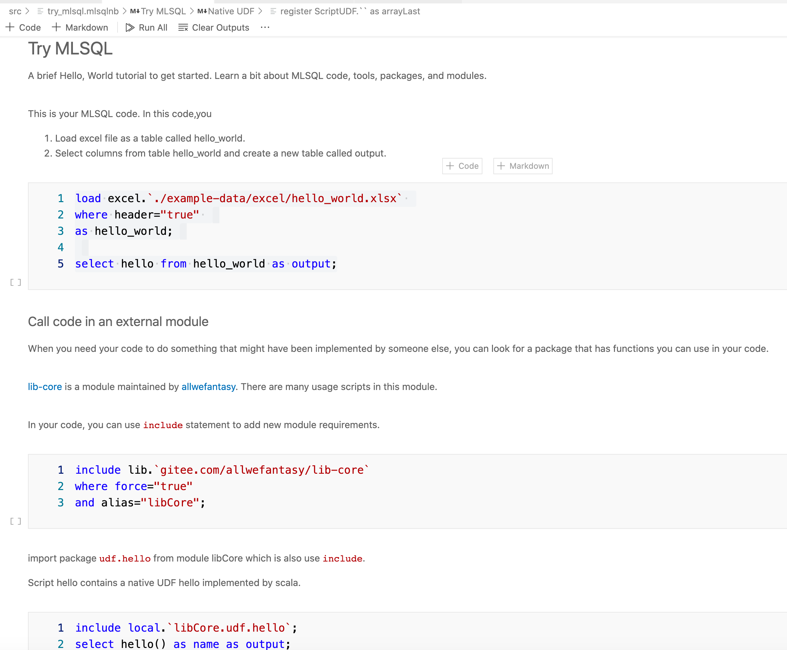
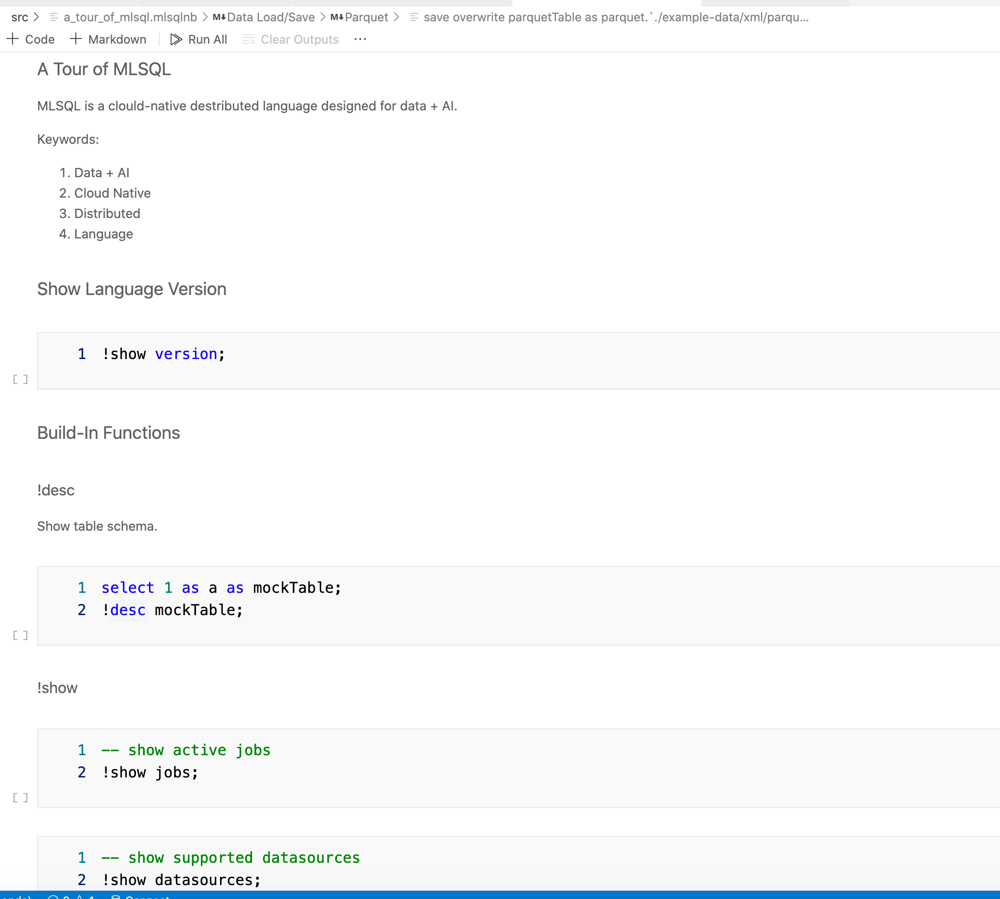
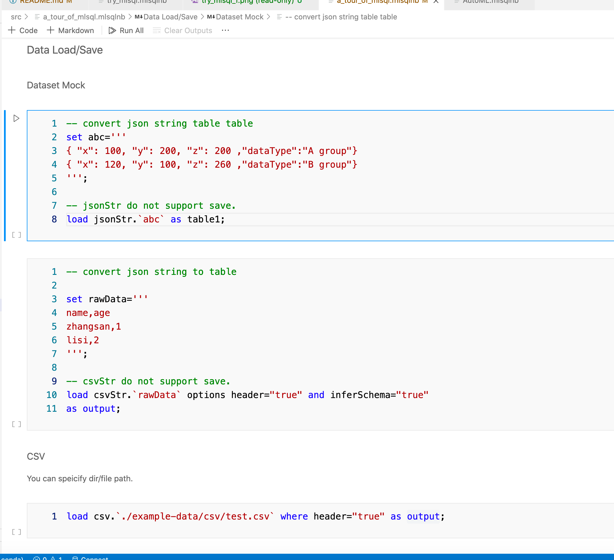

# MLSQL Lang example project

This is a mlsql-lang example project.

## Installation Of MLSQL Lang IDE

1. Download [Visual Studio Code](https://code.visualstudio.com/)
2. Download MLSQL Lang VSCode plugin
    * [Winwdows](http://download.mlsql.tech/mlsql-win-0.0.6.vsix)
    * [Mac](http://download.mlsql.tech/mlsql-mac-0.0.6.vsix)
    * [Linux](http://download.mlsql.tech/mlsql-linux-0.0.6.vsix)

After installation of `Visual Studio Code` , switch to  `Extensions` tab, click `...` on right side of search bar, find the item `Install from VSIX...`, choose the VSCode plugin we had already downloaded in preview step and intall it.

Notice that for now we only support Ligt theme in vscode.
Select Code > Preferences > Color Theme :

In command palette popup，select the light color:

## Download this project

Click `Clone or download` and select  `Download ZIP`, then you get the package of this project. Unzip it in you desktop.

## Open this project in vscode

Select File > Open...  and choose the location where we unzip this project.

## Tutorial

1. `./src/try_mlsql` is a good start point for you to learn MLSQL.
2. `./src/a_tour_of_mlsql` you can learn full picture of MLSQL Lang.

## ./src/try_mlsql

## ./src/a_tour_of_mlsql

