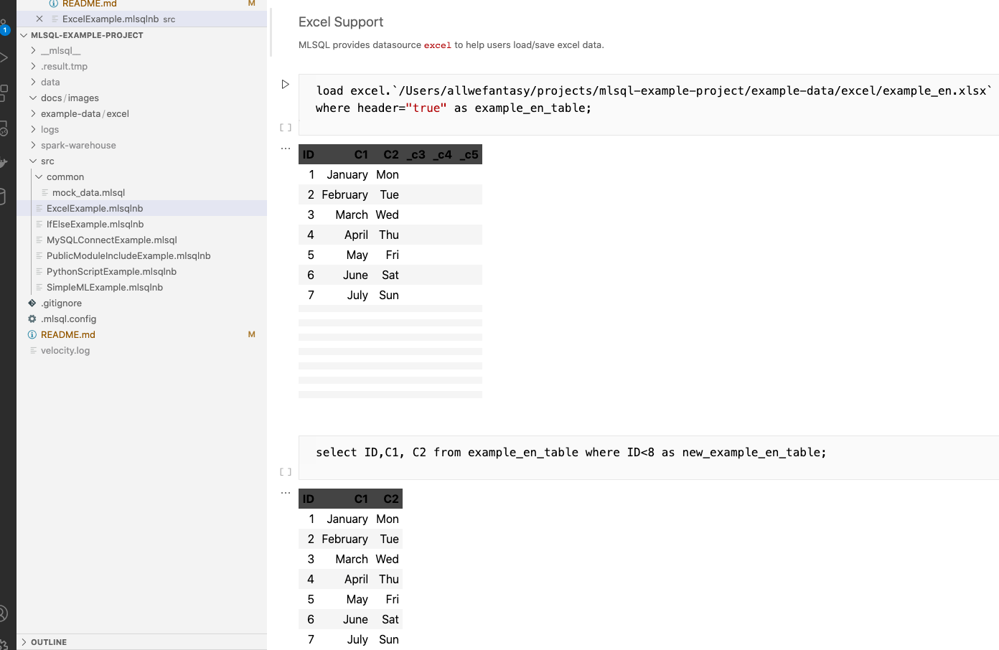
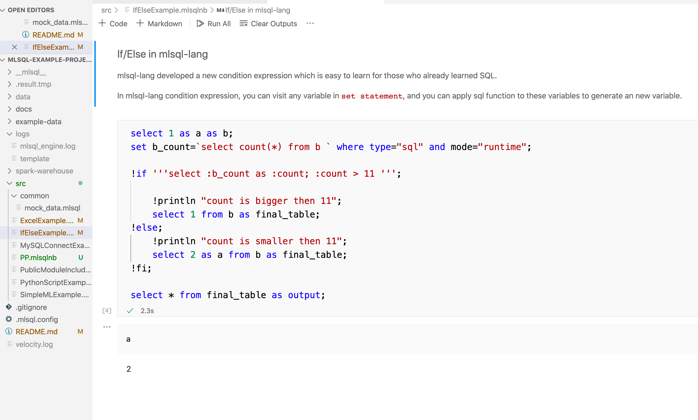
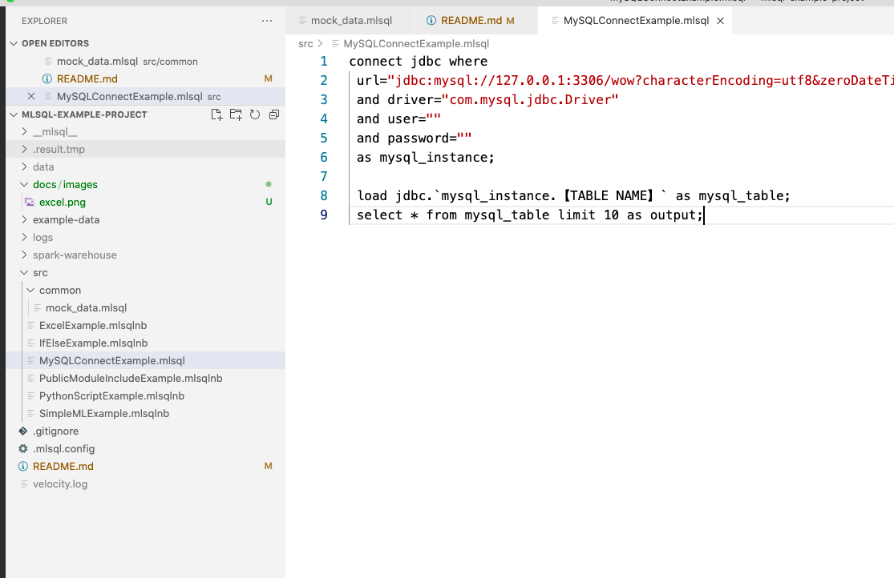
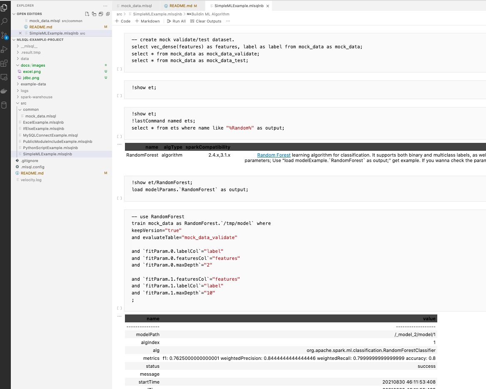
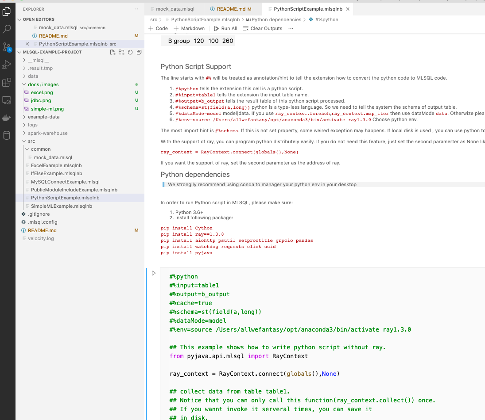
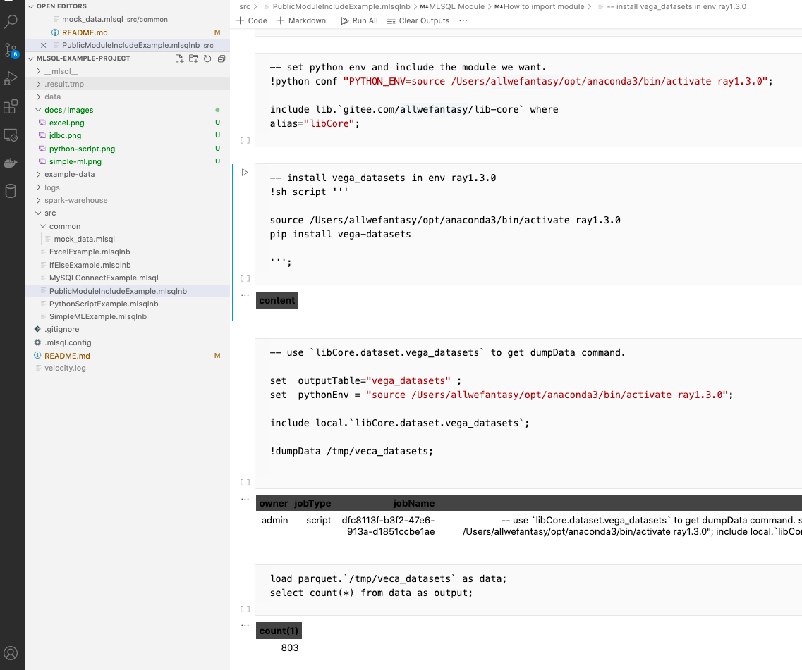

## Mlsql-lang vscode example project

This is a mlsql-lang example project.

> Notice: 
> 1. Work with mslql-lang-vscode-plugin 0.0.4
> 2. Mac/Linux is tested. Windows is not test yet.

1. Install [Visual Studio Code](https://code.visualstudio.com/)
2. Install mlsql-lang vscode plugin from 
   
   * [mlsql-lang-vscode-plugin/github](https://github.com/allwefantasy/mlsql-lang-vscode-plugin) or   
   * [mlsql-lang-vscode-plugin/gitee](https://gitee.com/allwefantasy/mlsql-lang-vscode-plugin)

3. Open this project with vscode

### Examples

Before you can run all this examples(contains python script), modify 
`./src/common/PyHeader.mlsql` and set properly python env.

* ✅ src/ExcelExample
* ✅ src/MySQLConnectExample
* ✅ src/SimpleMLExample
* ✅ src/PythonScriptExample
* ✅ src/PublicModuleIncludeExample
* ✅ src/IfElseExample
* (working) src/analysis/example/UserBehavior

## Restart mlsql lang language server

Run command in vscode:  Developer: Reload Window

### ExcelExample

### IfElseExample

### MySQLConnectExample

### SimpleMLExample

### PythonScriptExample

### PublicModuleIncludeExample

